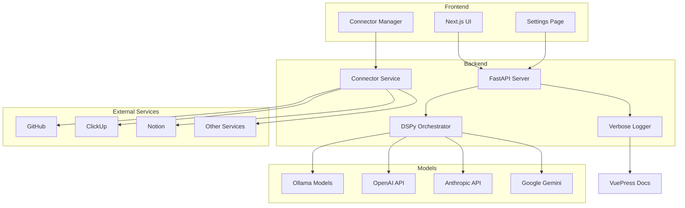

# AI Orchestrator Documentation

Welcome to the AI Orchestrator documentation. This system provides intelligent routing between local and cloud-based AI models, with comprehensive workflow automation and service integration capabilities.

## 🚀 Features

### Intelligent Model Routing
- **Smart Selection**: Automatically routes tasks to the most appropriate model
- **Free-First Mode**: Prioritizes local models to minimize costs
- **Paid Priority**: Uses premium models for critical tasks
- **Explicit Control**: Override auto-selection with manual model choice

### Multi-Provider Support
- **Local Models** via Ollama (DeepSeek, Qwen, Kimi, Mistral)
- **OpenAI** (GPT-4o, GPT-4-turbo)
- **Anthropic** (Claude 3.5 Sonnet, Haiku, Opus)
- **Google** (Gemini 2.0, Gemini Pro)

### Service Connectors
Seamlessly integrate with your existing tools:
- **ClickUp** - Task management
- **GitHub** - Code repositories  
- **Google Workspace** - Email, docs, calendar
- **Todoist** - Personal tasks
- **Linear** - Issue tracking
- **Notion** - Knowledge base
- **Discord** - Team communication

### Agentic Workflows
Create complex multi-step workflows that:
- Chain tasks across different models
- Execute actions across connected services
- Generate documentation automatically
- Create visual diagrams with Mermaid
- Integrate with design tools like Figma

### Verbose Logging & Documentation
- Captures all prompts and responses
- Generates markdown documentation automatically
- Creates daily summaries and insights
- Integrates with VuePress for searchable docs

## 📊 System Architecture

## 🎯 Use Cases

### For Developers
- Code generation with context from GitHub
- Automated PR creation and review
- Documentation generation from code
- Issue tracking integration

### For Product Managers  
- Requirements analysis and refinement
- User story generation
- Task distribution across teams
- Progress tracking and reporting

### For Content Creators
- Content generation with brand consistency
- Multi-platform publishing workflows
- SEO optimization
- Analytics integration

## 🔧 Getting Started

1. **Configure API Keys** in Settings
2. **Connect Services** you want to integrate
3. **Set Routing Mode** (Free-first, Smart, or Paid)
4. **Start Creating** workflows and automations

## 📚 Documentation Structure

- `/prompts/` - All captured prompts
- `/responses/` - Valuable model responses
- `/workflows/` - Executed workflow logs
- `/insights/` - Daily summaries and analytics
- `/guide/` - User guides and tutorials
- `/api/` - API reference documentation

---

Built with ❤️ by Derozic | Powered by DSPy, Ollama, and VuePress